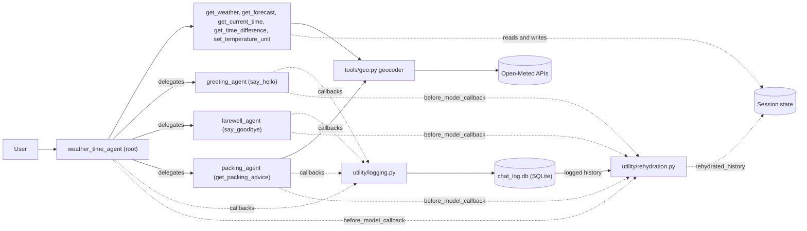

# ADK Weather & Time Agent Team

A multi-agent, multi-tool assistant built with Google's [Agent Development Kit (ADK)](https://adk.dev).
It answers questions about the **current weather, multi-day forecast and local time for any city in the world**, remembers a
temperature-unit preference during a session, and delegates greetings, farewells and packing advice to specialist sub-agents.

It follows the official ADK tutorials [Multi-tool agent](https://adk.dev/tutorials/multi-tool-agent/) and
[Agent team](https://adk.dev/tutorials/agent-team/), with real data instead of the tutorials' mock weather.

---

## Table of contents

1. [What it does](#what-it-does)
2. [Architecture](#architecture)
3. [Repository layout](#repository-layout)
4. [Chat logging](#chat-logging)
5. [Rehydration](#rehydration)
6. [Tools](#tools)
7. [Agents](#agents)
8. [Session state](#session-state)
9. [Requirements](#requirements)
10. [Setup](#setup)
11. [Verify the installation](#verify-the-installation)
12. [Run the agents](#run-the-agents)
13. [Example prompts](#example-prompts)
14. [Model choice and rate limits](#model-choice-and-rate-limits)
15. [Troubleshooting](#troubleshooting)
16. [Tutorial coverage](#tutorial-coverage)
17. [Known limitations](#known-limitations)
18. [Data sources](#data-sources)

---

## What it does

- Current weather for any city (temperature, feels-like, humidity, wind, conditions)
- Daily forecast for 1-7 days
- Current local time in any city, and the time difference between two cities
- Packing advice for a trip, derived from the forecast
- Remembers the preferred temperature unit (Celsius or Fahrenheit) for the session
- Delegates greetings, farewells and packing questions to dedicated sub-agents
- Logs every conversation (user messages, agent replies, tool calls) to a local SQLite database and can export it to a text file
- Restores a conversation from that log when ADK has lost the session's earlier turns (rehydration)

City lookup works worldwide through geocoding, so there is no fixed city list. Ambiguous names can be qualified, for example
`Paris, Texas` or `Springfield, Illinois`.

## Architecture



The root agent decides for each message whether to answer with one of its own tools or to transfer control to a sub-agent
(ADK "auto flow" delegation, driven by each sub-agent's `description`).

## Repository layout

```
adk-agents/
├── README.md
├── requirements.txt          # dependencies (pip install -r requirements.txt)
├── check_setup.py            # verifies the installation without using model quota
├── export_log.py             # exports the SQLite chat log to chat_log.txt
├── .env.example              # template for the API key file (committed)
├── .gitignore
├── chat_log.db               # SQLite chat log (created on first run, git-ignored)
├── chat_log.txt              # text export of the log (created by export_log.py, git-ignored)
└── backend/                  # the ADK agent package
    ├── .env                  # your real key (local only, git-ignored)
    ├── __init__.py           # `from . import agent`
    ├── agent.py              # re-exports root_agent so ADK can discover the package
    ├── main.py               # root agent (weather_time_agent)
    ├── config.py             # shared model name
    ├── agents/
    │   ├── greeting_agent/   # greeting_agent.py, tools/say_hello.py
    │   ├── farewell_agent/   # farewell_agent.py, tools/say_goodbye.py
    │   ├── packing_agent/    # packing_agent.py, tools/get_packing_advice.py
    │   ├── time_agent/       # tools/time_tools.py (get_current_time, get_time_difference)
    │   └── weather_agent/    # tools/weather_tools.py (get_weather), tools/forecast_tools.py (get_forecast)
    ├── tools/                # shared helpers: geo.py (geocoding), preference_tools.py (set_temperature_unit)
    └── utility/
        ├── logging.py        # SQLite chat logger and ADK callbacks
        └── rehydration.py    # restores logged history into the model input (before_model_callback)
```

ADK discovers the agent by the package name and needs an `agent.py` in it, so `backend/` must stay a direct child of the folder you run `adk` from and must keep `agent.py`.

## Chat logging

Every conversation is logged to `chat_log.db` (SQLite) in the repository root through ADK callbacks defined in
`backend/utility/logging.py`. The `sessions` table holds one row per ADK session (the same ID as `session=` in the web UI URL).
The `messages` table holds one row per user message, agent reply and tool call (`session_id`, `timestamp`, `role`, `content`,
`tool_name`, `tool_args`, `tool_result`, `error`, `invocation_id`). `invocation_id` is the ADK invocation (one user turn) that
the row belongs to; rehydration uses it to skip the current turn. When the logger is imported and an older `chat_log.db` has
no `invocation_id` column, the logger adds it automatically (`ALTER TABLE`). Rows logged before that have `NULL` in the
column. Sub-agent replies are logged under the sub-agent's name (for example
`greeting_agent`), and delegation shows up as a `transfer_to_agent` tool call. The logger uses only the Python standard library.

To produce a readable text file, run from the repository root:

```
python export_log.py
```

This writes `chat_log.txt`, grouped by session, with long tool results shortened (the full data stays in `chat_log.db`).
Both log files are git-ignored. Delete them to start with a clean log.

## Rehydration

**What and why.** ADK keeps a session's earlier turns in its session store. If the store has no earlier turns for a session,
for example after a restart with an in-memory store, the model sees only the new message and has forgotten the conversation.
The chat log in `chat_log.db` still has it. Rehydration gives the logged conversation back to the model so it can continue.

**How it works.** `backend/utility/rehydration.py` provides two functions:

- `load_history(session_id, current_invocation_id)` reads the session's logged messages from `chat_log.db`: user messages and
  agent replies only (no tool rows, no empty content), at most the last 20 (`MAX_MESSAGES`), oldest first. Rows of the current
  invocation are excluded; rows whose `invocation_id` is `NULL` (logged before the column existed) are included. Agent replies
  get the role `model`, and leading `model` messages are dropped so the history starts with a user message.
- `rehydrate_history(callback_context, llm_request)` is the `before_model_callback` of all four agents (`main.py`,
  `greeting_agent.py`, `farewell_agent.py`, `packing_agent.py`). It runs before every model call:
  1. If session state already has `rehydrated_history`, it puts those messages in front of the model input.
  2. Otherwise, if the ADK session has events from an earlier invocation, ADK already knows the conversation and nothing is
     restored.
  3. Otherwise it calls `load_history()`. If the log has messages for this session ID, they are saved in session state as
     `rehydrated_history` and put in front of the model input. Later turns read them from state (step 1), so they stay in the
     model input for the rest of the session.

**Limits**

- Only user and agent text is restored. Tool calls and tool results are not.
- At most the last 20 logged messages are restored.
- The session ID must match the ID in the log. A new session gets a new ID, so nothing is restored there.
- The restored history appears in the **State** tab of the web UI as `rehydrated_history`.

**Manual test**

By default `adk web` keeps sessions in `backend/.adk/session.db`, so a plain restart does not lose them. This test starts the
server with an in-memory store to simulate an empty session store.

1. Run `adk web --no-reload`, chat a few turns, and copy the session ID from the URL (`session=...`) or from
   `python export_log.py` (the `SESSION <id>` lines in `chat_log.txt`).
2. Stop the server (Ctrl+C) and restart it with an empty in-memory session store:
   ```
   adk web --no-reload --session_service_uri memory://
   ```
3. In a second terminal, create a session with the old ID (PowerShell):
   ```powershell
   Invoke-RestMethod -Method Post -Uri "http://127.0.0.1:8000/apps/backend/users/user/sessions/<OLD-ID>" -ContentType "application/json" -Body "{}"
   ```
4. Open `http://127.0.0.1:8000/dev-ui/?app=backend&userId=user&session=<OLD-ID>` and ask what you said earlier. The agent should
   answer from the restored history, and the State tab should show `rehydrated_history`.
5. Control: click **New Session** and ask again. The agent must not know.

## Tools

| Tool | File | Used by | Purpose |
|---|---|---|---|
| `get_weather(city)` | `agents/weather_agent/tools/weather_tools.py` | root | Current weather; reads the unit preference from state and stores `last_city_checked` |
| `get_forecast(city, days=3)` | `agents/weather_agent/tools/forecast_tools.py` | root | Daily forecast, 1-7 days |
| `get_current_time(city)` | `agents/time_agent/tools/time_tools.py` | root | Local time using the city's IANA timezone |
| `get_time_difference(city_a, city_b)` | `agents/time_agent/tools/time_tools.py` | root | Current UTC-offset difference in hours |
| `set_temperature_unit(unit)` | `tools/preference_tools.py` | root | Saves Celsius or Fahrenheit to session state |
| `say_hello(name=None)` | `agents/greeting_agent/tools/say_hello.py` | `greeting_agent` | Greeting |
| `say_goodbye()` | `agents/farewell_agent/tools/say_goodbye.py` | `farewell_agent` | Farewell |
| `get_packing_advice(city, days=3)` | `agents/packing_agent/tools/get_packing_advice.py` | `packing_agent` | Packing list derived from the trip forecast |

`tools/geo.py` is a shared helper (`geocode`, `label`) that turns a city name into coordinates and a timezone through the Open-Meteo
geocoding API. When a qualifier is given (`Paris, Texas`) it is matched against country, country code and region.

### Packing rules (`get_packing_advice`)

Rules are plain Python, so the advice comes from forecast data and not from model guesswork.

| Condition over the trip | Added items |
|---|---|
| Lowest temperature below 0 °C | heavy winter coat, gloves, hat and scarf, thermal base layer |
| Lowest temperature 0-9 °C | warm jacket, sweater |
| Lowest temperature 10-17 °C | light jacket |
| Highest temperature 28 °C or more | light breathable clothing, sunglasses, sunscreen, water bottle |
| Highest temperature 20-27 °C | t-shirts, sunglasses |
| Highest temperature below 20 °C | long-sleeved tops |
| Daily high/low swing of 12 °C or more | extra layers |
| Rain chance of 50 % or more | umbrella, waterproof jacket |
| Snow in the forecast | waterproof boots |
| Thunderstorms in the forecast | indoor-activity plan |

## Agents

| Agent | Role | Model |
|---|---|---|
| `weather_time_agent` (root) | Answers weather, forecast and time questions itself, saves preferences, delegates everything else | `config.MODEL` |
| `greeting_agent` | Greetings only, through `say_hello` | `config.MODEL` |
| `farewell_agent` | Farewells only, through `say_goodbye` | `config.MODEL` |
| `packing_agent` | Packing advice only, through `get_packing_advice` | `config.MODEL` |

All agents use the model defined once in `backend/config.py`.

## Session state

| Key | Written by | Meaning |
|---|---|---|
| `user_preference_temperature_unit` | `set_temperature_unit` | `Celsius` (default) or `Fahrenheit`; read by `get_weather` |
| `last_city_checked` | `get_weather` | Last city looked up |
| `last_weather_report` | root agent `output_key` | Root agent's last final reply; not updated when a sub-agent writes the reply |
| `rehydrated_history` | `rehydrate_history` callback | Logged user and agent messages restored from `chat_log.db`; set only when ADK had no earlier turns for the session (see [Rehydration](#rehydration)) |

State belongs to one session, so a new session starts with Celsius. Inspect it in the **State** tab of the ADK web UI.

## Requirements

- **Python 3.10 or newer** (the code uses `X | None` type syntax). Developed and tested on Python 3.14 on Windows 11.
- **Git**
- **A Google Gemini API key**, free from [Google AI Studio](https://aistudio.google.com/app/apikey)
- **Internet access** to the Gemini API and to Open-Meteo. No Open-Meteo key is needed.

## Setup

Run all commands from the repository root (the folder that contains `backend/`).

### 1. Clone

```
git clone https://github.com/<your-username>/adk-agents.git
cd adk-agents
```

### 2. Create and activate a virtual environment

**Windows (PowerShell)**
```powershell
python -m venv .venv
.venv\Scripts\Activate.ps1
```
If activation is blocked, run `Set-ExecutionPolicy -Scope CurrentUser RemoteSigned` once and try again.

**macOS / Linux**
```bash
python3 -m venv .venv
source .venv/bin/activate
```

The prompt should now start with `(.venv)`.

### 3. Install dependencies

```
pip install -r requirements.txt
```

`requirements.txt` pins `google-adk` to the tested version. All other packages are installed as its dependencies.

### 4. Add your API key

Copy the template and edit the copy. Do this in a text editor such as VS Code so the file is saved as UTF-8.

**Windows (PowerShell)**
```powershell
Copy-Item .env.example backend\.env
```

**macOS / Linux**
```bash
cp .env.example backend/.env
```

Then open `backend/.env` and replace the placeholder:

```
GOOGLE_GENAI_USE_VERTEXAI=FALSE
GOOGLE_API_KEY="your-real-key"
```

`.env` is listed in `.gitignore` and must never be committed.

## Verify the installation

```
python check_setup.py
```

The script checks the Python version, the `.env` file, package imports, the agent structure, the chat log schema
(`invocation_id` column), the rehydration module and `load_history()` on a temporary database, and every tool against the live
Open-Meteo API. It sends **no requests to Gemini**, so it uses no model quota. Every line should read `PASS`.

## Run the agents

**Terminal chat**
```
adk run backend
```
Type `exit` to quit. The name in square brackets before each reply shows which agent answered.

**Web UI (recommended for inspection)**
```
adk web --no-reload
```
Open the printed URL (usually http://127.0.0.1:8000), select `backend`, and use the Events, State and Traces tabs.
The `--no-reload` flag avoids a subprocess error on Windows. Restart the command after editing any Python file, and click
**New Session** to reset the conversation and state. Each web UI session is logged under its own session ID, the same value as `session=` in the page URL.

## Example prompts

| Prompt | Handled by |
|---|---|
| Hello, I'm Flora | `greeting_agent` |
| What is the weather in Ulaanbaatar? | root, `get_weather` |
| 5-day forecast for Reykjavik | root, `get_forecast` |
| What time is it in Wellington? | root, `get_current_time` |
| Time difference between Budapest and Tokyo? | root, `get_time_difference` |
| Use Fahrenheit from now on | root, `set_temperature_unit` |
| What should I pack for 4 days in Lisbon? | `packing_agent` |
| Weather in Paris, Texas | root, `get_weather` with a qualified name |
| Thanks, bye! | `farewell_agent` |

## Model choice and rate limits

The model is set in one place, `backend/config.py`:

```python
MODEL = "gemini-3.5-flash-lite"
```

- A Flash-Lite model is enough here: the work is tool selection and short summaries.
- A fixed model ID is used instead of a `-latest` alias so behavior does not change silently.
- The free tier has a per-model requests-per-minute limit. A question that uses a tool costs 2 model requests, and a delegated
  turn costs 3 or more. If you see `429 RESOURCE_EXHAUSTED`, wait a minute or check your limits at
  https://aistudio.google.com/rate-limit and pick a model with a higher limit.
- On the free tier, Google may use your prompts to improve its products. Do not enter private data.

## Troubleshooting

| Symptom | Cause and fix |
|---|---|
| `adk` is not recognized | The virtual environment is not active. Run the activate command from step 2 |
| `Activate.ps1 cannot be loaded` | Run `Set-ExecutionPolicy -Scope CurrentUser RemoteSigned` |
| `429 RESOURCE_EXHAUSTED` | Free-tier requests-per-minute limit. Wait, or switch model in `config.py` |
| `503 UNAVAILABLE` | Google's model is overloaded. Retry after a moment |
| Missing key or authentication error | `backend/.env` is missing, still has the placeholder, or was saved with the wrong encoding. Recreate it in a text editor |
| `Unknown timezone` or `ZoneInfoNotFoundError` on Windows | `tzdata` is missing. Run `pip install -r requirements.txt` |
| `No agents found in current folder` or `backend` missing from the app list | Run `adk web` from the repository root, not from inside `backend/`, and make sure `backend/agent.py` exists. ADK skips a folder without `agent.py` and does not report why |
| `No module named backend` | Run the command from the repository root, not from inside `backend/` |
| `SSL: CERTIFICATE_VERIFY_FAILED` when a tool calls Open-Meteo | Antivirus or a proxy is intercepting HTTPS. Run `pip install --upgrade certifi pip-system-certs` or try another network |
| `chat_log.txt` is empty or has no agent replies | The model call failed (for example an API key error), so only the user message was logged. Fix the error and chat again |
| Changes to Python files have no effect | `adk web --no-reload` does not reload. Stop it with Ctrl+C and start it again |
| Agent says it saved a preference but the State tab is empty | Check the event list for a `set_temperature_unit` call. Save `main.py`, restart and open a new session |
| `Could not find a place called ...` | The geocoder found no match. Check the spelling or add a country |
| `duplicate column name` when a fresh `chat_log.db` is created | The `CREATE TABLE messages` statement in `backend/utility/logging.py` lists a column twice. Each column may appear only once |
| Rehydration restores nothing | The session ID does not match the one in `chat_log.db` (a new session has a new ID; compare with `python export_log.py`), or ADK still has the session's earlier turns, so nothing needs restoring |

## Tutorial coverage

| Tutorial part | Status |
|---|---|
| Multi-tool agent: weather and time tools | Done, with real APIs and worldwide cities; extra own tools added |
| Agent team, Step 1: weather agent | Done (real data instead of mock data) |
| Agent team, Step 2: multi-model with LiteLLM (optional) | Not implemented |
| Agent team, Step 3: delegation to sub-agents | Done (greeting, farewell, and a packing agent) |
| Agent team, Step 4: session state | Done; the unit preference is set through a tool because `adk run` and `adk web` create the session |
| Agent team, Steps 5-6: callback guardrails | Not implemented yet. Callbacks are used for chat logging instead |
| Extra: chat logging to SQLite with text export | Done (`backend/utility/logging.py`, `export_log.py`) |
| Extra: session rehydration from the SQLite log | Done (`backend/utility/rehydration.py`, `before_model_callback` on all agents) |

## Known limitations

- The forecast and packing tools always report Celsius; only `get_weather` follows the unit preference.
- When a city name is ambiguous, the geocoder uses the most populated match unless a qualifier is given. The reply names the
  resolved place so a wrong match is visible.
- By default (google-adk 2.10.0), `adk web` and `adk run` store sessions and their state in a local SQLite file,
  `backend/.adk/session.db`, so they survive a restart. With `--session_service_uri memory://` they are lost when the server
  stops; rehydration then restores only the logged user and agent text, not other state keys.
- Forecast data covers at most 7 days.
- The chat log is one SQLite file shared by all runs and is never cleared automatically.

## Data sources

- Weather, forecast and geocoding: [Open-Meteo](https://open-meteo.com). The free API is intended for non-commercial use; see
  their terms for details and attribution.
- Language model: Google Gemini through the Gemini API.
