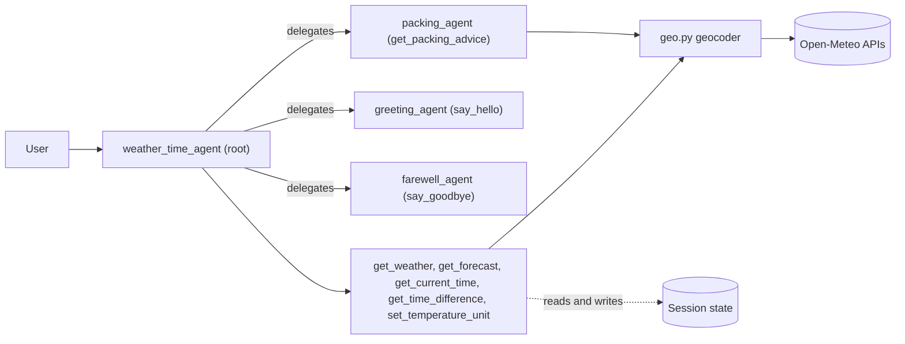

# ADK Weather & Time Agent Team

A multi-agent, multi-tool assistant built with Google's [Agent Development Kit (ADK)](https://adk.dev).
It answers questions about the **current weather, multi-day forecast and local time for any city in the world**, remembers a
temperature-unit preference during a session, and delegates greetings, farewells and packing advice to specialist sub-agents.

It follows the official ADK tutorials [Multi-tool agent](https://adk.dev/tutorials/multi-tool-agent/) and
[Agent team](https://adk.dev/tutorials/agent-team/), with real data instead of the tutorials' mock weather.

---

## Table of contents

1. [What it does](#what-it-does)
2. [Architecture](#architecture)
3. [Repository layout](#repository-layout)
4. [Tools](#tools)
5. [Agents](#agents)
6. [Session state](#session-state)
7. [Requirements](#requirements)
8. [Setup](#setup)
9. [Verify the installation](#verify-the-installation)
10. [Run the agents](#run-the-agents)
11. [Example prompts](#example-prompts)
12. [Model choice and rate limits](#model-choice-and-rate-limits)
13. [Troubleshooting](#troubleshooting)
14. [Tutorial coverage](#tutorial-coverage)
15. [Known limitations](#known-limitations)
16. [Data sources](#data-sources)

---

## What it does

- Current weather for any city (temperature, feels-like, humidity, wind, conditions)
- Daily forecast for 1-7 days
- Current local time in any city, and the time difference between two cities
- Packing advice for a trip, derived from the forecast
- Remembers the preferred temperature unit (Celsius or Fahrenheit) for the session
- Delegates greetings, farewells and packing questions to dedicated sub-agents

City lookup works worldwide through geocoding, so there is no fixed city list. Ambiguous names can be qualified, for example
`Paris, Texas` or `Springfield, Illinois`.

## Architecture



The root agent decides for each message whether to answer with one of its own tools or to transfer control to a sub-agent
(ADK "auto flow" delegation, driven by each sub-agent's `description`).

## Repository layout

```
adk-agents/
├── README.md
├── requirements.txt          # direct dependencies (use this to install)
├── requirements-lock.txt     # optional exact snapshot of a working environment
├── check_setup.py            # verifies the installation without using model quota
├── .gitignore
└── multi_tool_agent/         # the ADK agent package
    ├── .env.example          # template for the API key file (committed)
    ├── .env                  # your real key (local only, git-ignored)
    ├── __init__.py
    ├── agent.py              # root agent (weather_time_agent)
    ├── config.py             # shared model name
    ├── sub_agents.py         # greeting_agent, farewell_agent, packing_agent
    ├── geo.py                # geocoding helper (not a tool)
    ├── weather_tools.py      # get_weather
    ├── forecast_tools.py     # get_forecast
    ├── time_tools.py         # get_current_time, get_time_difference
    ├── preference_tools.py   # set_temperature_unit
    ├── greeting_tools.py     # say_hello, say_goodbye
    └── packing_tools.py      # get_packing_advice
```

ADK discovers the agent by the package name, so `multi_tool_agent/` must stay a direct child of the folder you run `adk` from.

## Tools

| Tool | File | Used by | Purpose |
|---|---|---|---|
| `get_weather(city)` | `weather_tools.py` | root | Current weather; reads the unit preference from state and stores `last_city_checked` |
| `get_forecast(city, days=3)` | `forecast_tools.py` | root | Daily forecast, 1-7 days |
| `get_current_time(city)` | `time_tools.py` | root | Local time using the city's IANA timezone |
| `get_time_difference(city_a, city_b)` | `time_tools.py` | root | Current UTC-offset difference in hours |
| `set_temperature_unit(unit)` | `preference_tools.py` | root | Saves Celsius or Fahrenheit to session state |
| `say_hello(name=None)` | `greeting_tools.py` | `greeting_agent` | Greeting |
| `say_goodbye()` | `greeting_tools.py` | `farewell_agent` | Farewell |
| `get_packing_advice(city, days=3)` | `packing_tools.py` | `packing_agent` | Packing list derived from the trip forecast |

`geo.py` is a shared helper (`geocode`, `label`) that turns a city name into coordinates and a timezone through the Open-Meteo
geocoding API. When a qualifier is given (`Paris, Texas`) it is matched against country, country code and region.

### Packing rules (`get_packing_advice`)

Rules are plain Python, so the advice comes from forecast data and not from model guesswork.

| Condition over the trip | Added items |
|---|---|
| Lowest temperature below 0 °C | heavy winter coat, gloves, hat and scarf, thermal base layer |
| Lowest temperature 0-9 °C | warm jacket, sweater |
| Lowest temperature 10-17 °C | light jacket |
| Highest temperature 28 °C or more | light breathable clothing, sunglasses, sunscreen, water bottle |
| Highest temperature 20-27 °C | t-shirts, sunglasses |
| Highest temperature below 20 °C | long-sleeved tops |
| Daily high/low swing of 12 °C or more | extra layers |
| Rain chance of 50 % or more | umbrella, waterproof jacket |
| Snow in the forecast | waterproof boots |
| Thunderstorms in the forecast | indoor-activity plan |

## Agents

| Agent | Role | Model |
|---|---|---|
| `weather_time_agent` (root) | Answers weather, forecast and time questions itself, saves preferences, delegates everything else | `config.MODEL` |
| `greeting_agent` | Greetings only, through `say_hello` | `config.MODEL` |
| `farewell_agent` | Farewells only, through `say_goodbye` | `config.MODEL` |
| `packing_agent` | Packing advice only, through `get_packing_advice` | `config.MODEL` |

All agents use the model defined once in `multi_tool_agent/config.py`.

## Session state

| Key | Written by | Meaning |
|---|---|---|
| `user_preference_temperature_unit` | `set_temperature_unit` | `Celsius` (default) or `Fahrenheit`; read by `get_weather` |
| `last_city_checked` | `get_weather` | Last city looked up |
| `last_weather_report` | root agent `output_key` | Root agent's last final reply; not updated when a sub-agent writes the reply |

State lives for one session only (in-memory), so a new session starts with Celsius. Inspect it in the **State** tab of the ADK
web UI.

## Requirements

- **Python 3.10 or newer** (the code uses `X | None` type syntax). Developed and tested on Python 3.14 on Windows 11.
- **Git**
- **A Google Gemini API key**, free from [Google AI Studio](https://aistudio.google.com/app/apikey)
- **Internet access** to the Gemini API and to Open-Meteo. No Open-Meteo key is needed.

## Setup

Run all commands from the repository root (the folder that contains `multi_tool_agent/`).

### 1. Clone

```
git clone https://github.com/<your-username>/adk-agents.git
cd adk-agents
```

### 2. Create and activate a virtual environment

**Windows (PowerShell)**
```powershell
python -m venv .venv
.venv\Scripts\Activate.ps1
```
If activation is blocked, run `Set-ExecutionPolicy -Scope CurrentUser RemoteSigned` once and try again.

**macOS / Linux**
```bash
python3 -m venv .venv
source .venv/bin/activate
```

The prompt should now start with `(.venv)`.

### 3. Install dependencies

```
pip install -r requirements.txt
```

To reproduce the exact package versions of the original environment instead, use `pip install -r requirements-lock.txt`.

### 4. Add your API key

Copy the template and edit the copy. Do this in a text editor such as VS Code so the file is saved as UTF-8.

**Windows (PowerShell)**
```powershell
Copy-Item multi_tool_agent\.env.example multi_tool_agent\.env
```

**macOS / Linux**
```bash
cp multi_tool_agent/.env.example multi_tool_agent/.env
```

Then open `multi_tool_agent/.env` and replace the placeholder:

```
GOOGLE_API_KEY="your-real-key"
```

`.env` is listed in `.gitignore` and must never be committed.

## Verify the installation

```
python check_setup.py
```

The script checks the Python version, the `.env` file, package imports, the agent structure, and every tool against the live
Open-Meteo API. It sends **no requests to Gemini**, so it uses no model quota. Every line should read `PASS`.

## Run the agents

**Terminal chat**
```
adk run multi_tool_agent
```
Type `exit` to quit. The name in square brackets before each reply shows which agent answered.

**Web UI (recommended for inspection)**
```
adk web --no-reload
```
Open the printed URL (usually http://127.0.0.1:8000), select `multi_tool_agent`, and use the Events, State and Traces tabs.
The `--no-reload` flag avoids a subprocess error on Windows. Restart the command after editing any Python file, and click
**New Session** to reset the conversation and state.

## Example prompts

| Prompt | Handled by |
|---|---|
| Hello, I'm Flora | `greeting_agent` |
| What is the weather in Ulaanbaatar? | root, `get_weather` |
| 5-day forecast for Reykjavik | root, `get_forecast` |
| What time is it in Wellington? | root, `get_current_time` |
| Time difference between Budapest and Tokyo? | root, `get_time_difference` |
| Use Fahrenheit from now on | root, `set_temperature_unit` |
| What should I pack for 4 days in Lisbon? | `packing_agent` |
| Weather in Paris, Texas | root, `get_weather` with a qualified name |
| Thanks, bye! | `farewell_agent` |

## Model choice and rate limits

The model is set in one place, `multi_tool_agent/config.py`:

```python
MODEL = "gemini-3.5-flash-lite"
```

- A Flash-Lite model is enough here: the work is tool selection and short summaries.
- A fixed model ID is used instead of a `-latest` alias so behavior does not change silently.
- The free tier has a per-model requests-per-minute limit. A question that uses a tool costs 2 model requests, and a delegated
  turn costs 3 or more. If you see `429 RESOURCE_EXHAUSTED`, wait a minute or check your limits at
  https://aistudio.google.com/rate-limit and pick a model with a higher limit.
- On the free tier, Google may use your prompts to improve its products. Do not enter private data.

## Troubleshooting

| Symptom | Cause and fix |
|---|---|
| `adk` is not recognized | The virtual environment is not active. Run the activate command from step 2 |
| `Activate.ps1 cannot be loaded` | Run `Set-ExecutionPolicy -Scope CurrentUser RemoteSigned` |
| `429 RESOURCE_EXHAUSTED` | Free-tier requests-per-minute limit. Wait, or switch model in `config.py` |
| `503 UNAVAILABLE` | Google's model is overloaded. Retry after a moment |
| Missing key or authentication error | `multi_tool_agent/.env` is missing, still has the placeholder, or was saved with the wrong encoding. Recreate it in a text editor |
| `Unknown timezone` or `ZoneInfoNotFoundError` on Windows | `tzdata` is missing. Run `pip install -r requirements.txt` |
| Agent not listed in `adk web`, or `No module named multi_tool_agent` | Run the command from the repository root, not from inside `multi_tool_agent/` |
| Changes to Python files have no effect | `adk web --no-reload` does not reload. Stop it with Ctrl+C and start it again |
| Agent says it saved a preference but the State tab is empty | Check the event list for a `set_temperature_unit` call. Save `agent.py`, restart and open a new session |
| `Could not find a place called ...` | The geocoder found no match. Check the spelling or add a country |

## Tutorial coverage

| Tutorial part | Status |
|---|---|
| Multi-tool agent: weather and time tools | Done, with real APIs and worldwide cities; extra own tools added |
| Agent team, Step 1: weather agent | Done (real data instead of mock data) |
| Agent team, Step 2: multi-model with LiteLLM (optional) | Not implemented |
| Agent team, Step 3: delegation to sub-agents | Done (greeting, farewell, and a packing agent) |
| Agent team, Step 4: session state | Done; the unit preference is set through a tool because `adk run` and `adk web` create the session |
| Agent team, Steps 5-6: callback guardrails | Not implemented yet |

## Known limitations

- The forecast and packing tools always report Celsius; only `get_weather` follows the unit preference.
- When a city name is ambiguous, the geocoder uses the most populated match unless a qualifier is given. The reply names the
  resolved place so a wrong match is visible.
- Session state is in-memory only and disappears when the server stops.
- Forecast data covers at most 7 days.

## Data sources

- Weather, forecast and geocoding: [Open-Meteo](https://open-meteo.com). The free API is intended for non-commercial use; see
  their terms for details and attribution.
- Language model: Google Gemini through the Gemini API.
